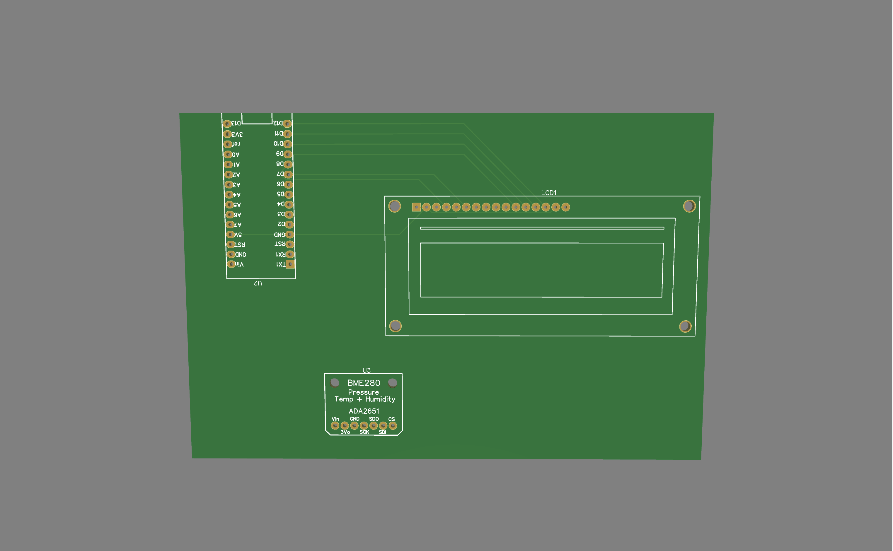
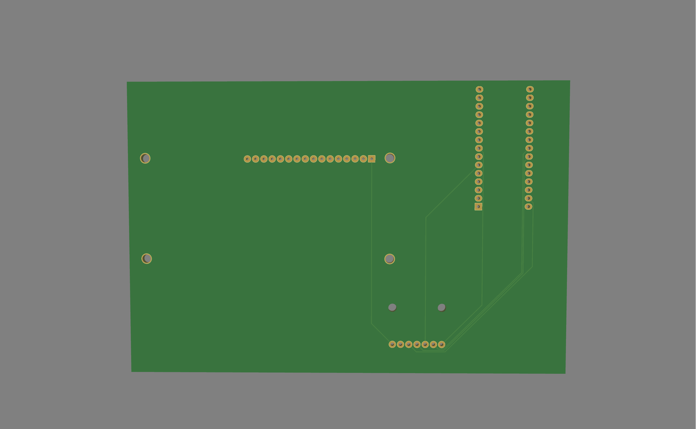
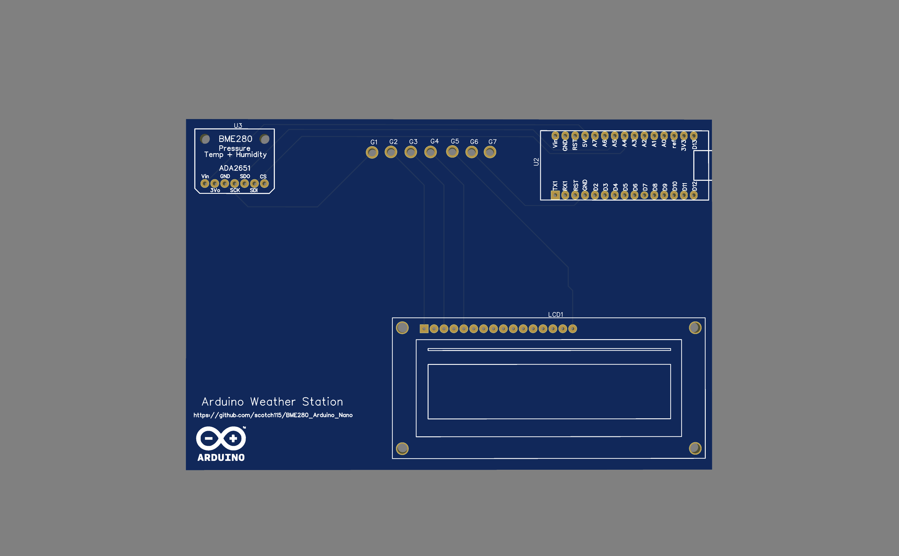
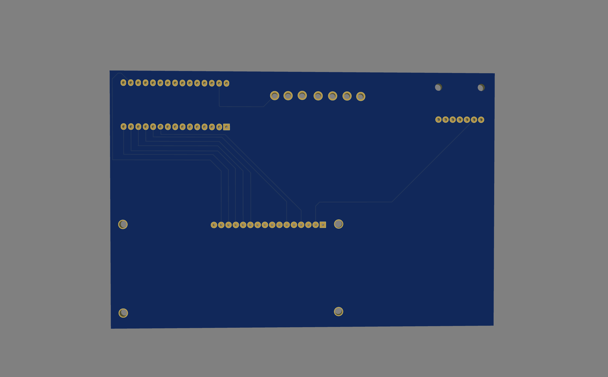
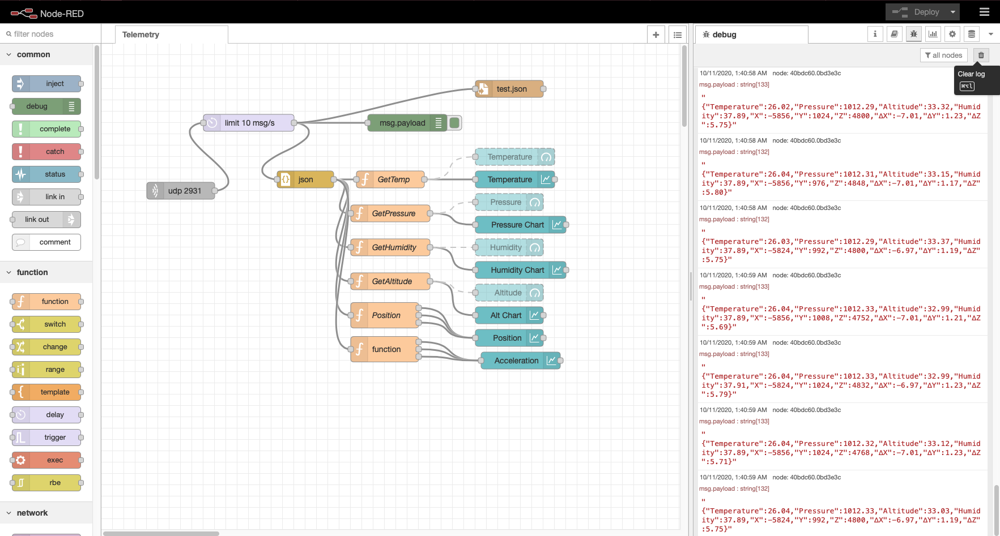
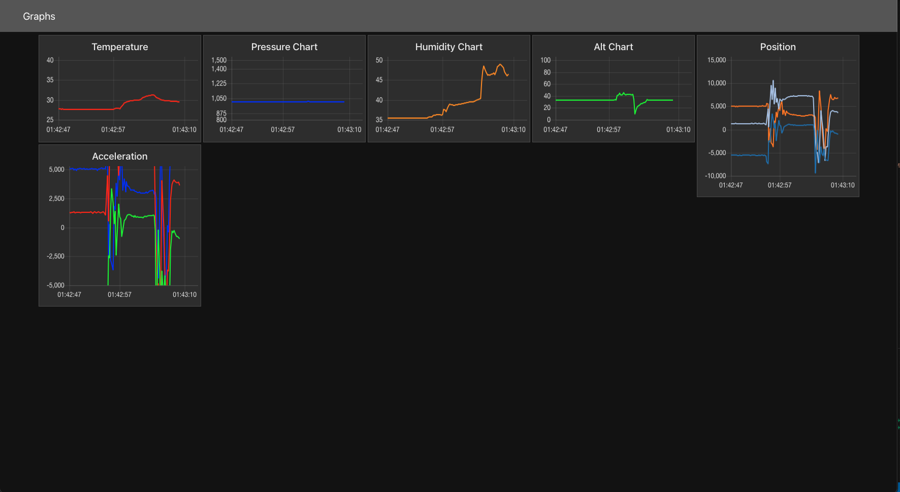

# Arduino Telemetry

Arduino-based IMU telemetry system for model rockets. 

Phase 1: Build a "weather station" to learn basics of handling sensor data  
- (bonus round: design a custom PCB!)

Phase 2: Using knowledge from Phase 1, design and build a custom flight computer using accessible components and write flight-capable software.

Phase 3: Design and build some form of ground-control system to communicate with flight computer, handle launch sequence and startup, relay data from flight computer to laptop.

Phase 4: Design and assemble rocket airframe, mount flight computer and Rotation Control System (RCS but not that kind ;P ), and test telemetry.

Phase 5: Test chute ejection system and determine required powder level.

Phase 6: Launch! 🚀

# Phase I - Research
## Temp Sensor PCB Design
### MK I
The MK I PCB was unfortunately unsuccessful, as I used the EasyEDA autoroute feature to try to solve track placement issues, however it did not take into account the possiblity of shorting the circuits, and neither did I, so my Arduino Nano blew a capacitor. Thankfully I have more, but this board was immediately decommissioned.

### MK II
The MK II PCB was carefully redesigned to improve upon the Mk I's failures by utilizing better component placement, built-in grounding pads, and hand-drawn track placement.

## Update:
Custom PCB worked after a slight modification to the electrical grounding system. 

# Phase II - Development
## Flight Computer
This is the assembled Mk.1 version of the flight computer, equipped with a barometer and IMU. Beta Ground Control system is functional and connects to the flight computer and the node-red server for data mapping.  

  

> UPDATE 
>
> The flight computer has been upgraded to use the Adafruit Feather M0 with LoRa Radio @900Mhz, and the onboard IMU has been upgraded to the MPU 6050 with 6 DOF (and gyroscope!).

# Phase III - Ground Control
## Mk. I
The AirLift Wi-Fi Co-Processor on both the Adalogger and Metro are able to successfully communicate with the Node-Red server, to send sensor data over UDP for collection and assimilation. The Node-Red dashboard is configured to not only build graphs in real-time, but also saves the data as it is received to a JSON file. 

  

## Mk. II
When the flight computer software is complete, the ground control system will be updated. Now that the onboard telemtry has shifted to primarily use 900Mhz radio, the plan for communicating with the rocket is to send information and data from the flight computer to a computer on the launch pad via radio, then relay the data received to the Mk.1 "ground control" computer using wifi, which will feed the data received into the node-red server for analysis and logging. The only major obstacle going this route is the increased latency of sending data over multiple wireless protocols, and processing it using multiple microprocessors. Much testing will need to be done before this system is launch-ready.

# Phase IV - Rocket Design and Construction 
> ~~Currently doing research and teaching myself rocket mechanics to design and build a stable, efficient rocket.~~  
> UPDATE (9/2022): The rocket airframe is being designed simultaneous with Phase II, and rudimentary schematics will be included in this repo for future use. Old PCB schematics have been scrubbed from the project, as they are no longer relevant or necessary. Airframe construction will likely begin in the order planned.

# Phase V - Chute Ejection System
> Development still in progress...

# Phase VI - Launch!
> Development still in progress...
